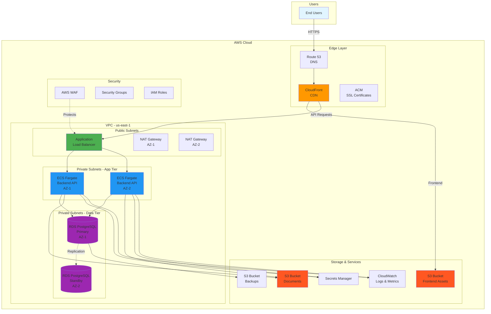
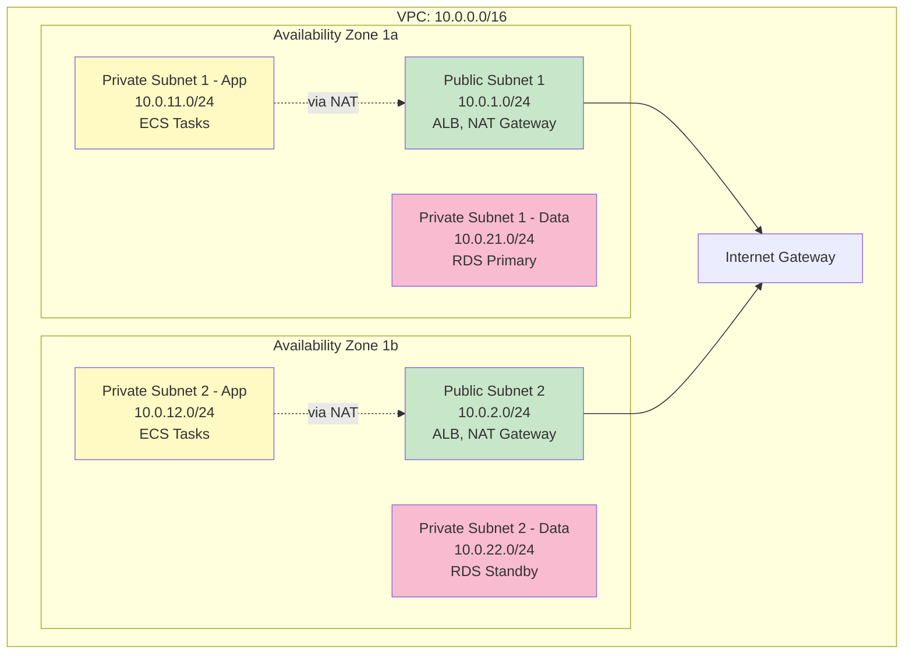
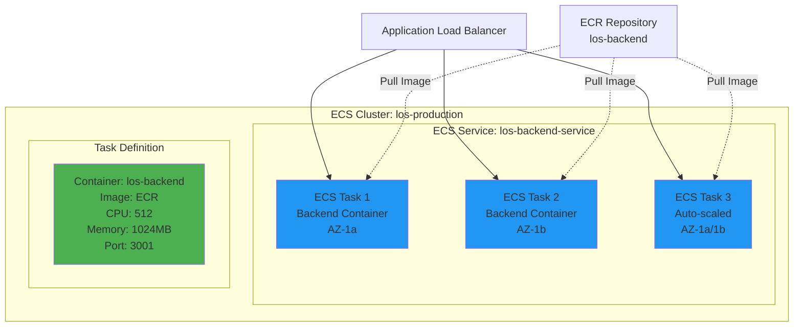
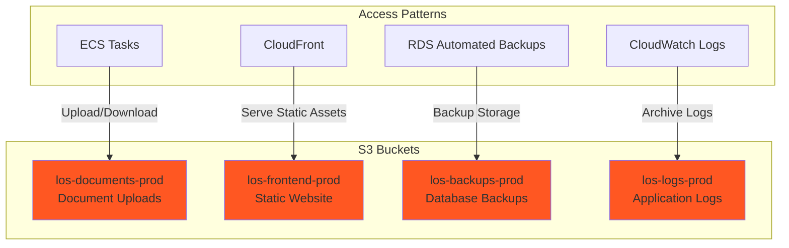
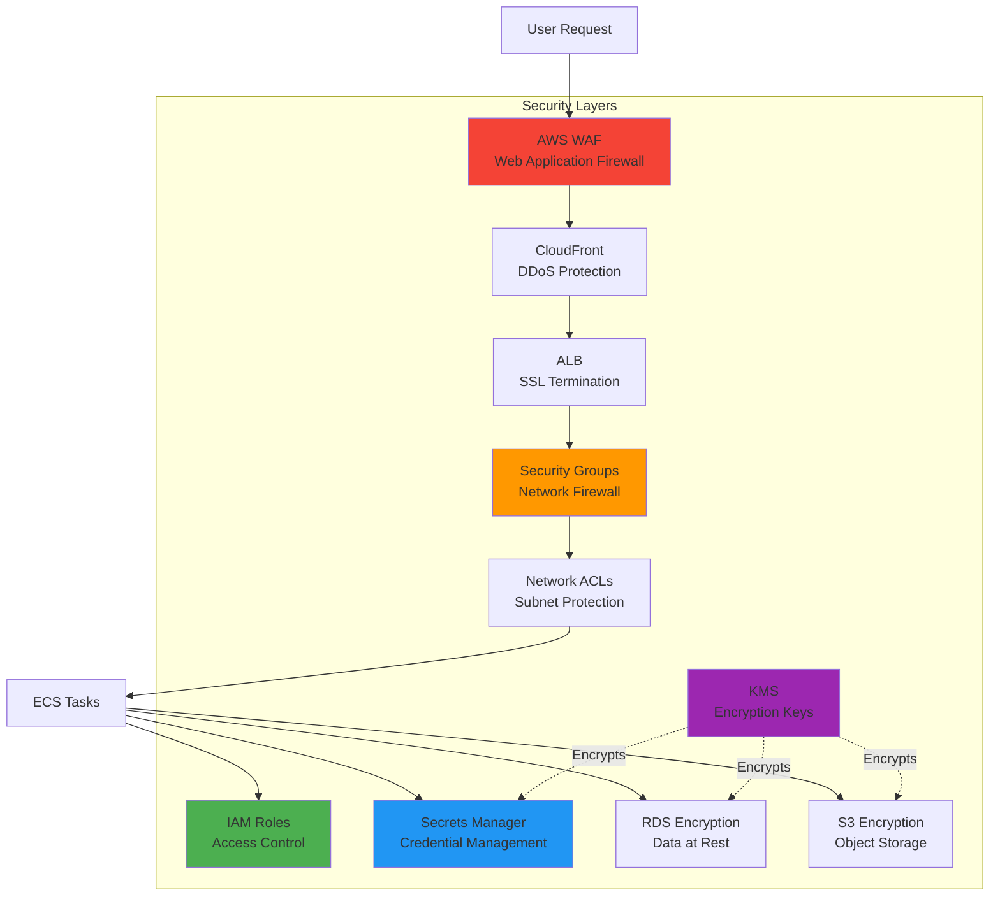
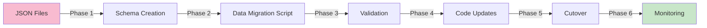
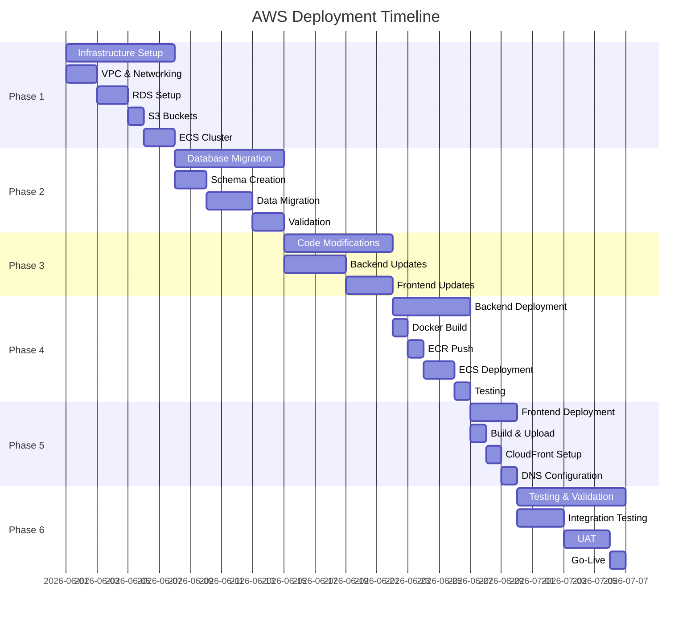

# AWS Deployment Architecture - Loan Origination System

## Executive Summary

This document provides a comprehensive blueprint for deploying the Loan Origination System (LOS) to AWS infrastructure. The architecture is designed for production-grade deployment with high availability, security, scalability, and compliance with banking industry standards.

**Target Environment:** AWS Cloud (Production-Ready)  
**Current State:** Local development with JSON file storage  
**Target State:** Cloud-native architecture with managed services  
**Estimated Timeline:** 6-8 weeks  
**Estimated Monthly Cost:** $450-650 USD

---

## Table of Contents

1. [Current System Analysis](#1-current-system-analysis)
2. [AWS Architecture Overview](#2-aws-architecture-overview)
3. [Network Architecture (VPC Design)](#3-network-architecture-vpc-design)
4. [Compute Layer](#4-compute-layer)
5. [Database Architecture](#5-database-architecture)
6. [Storage Architecture (S3)](#6-storage-architecture-s3)
7. [Content Delivery (CloudFront)](#7-content-delivery-cloudfront)
8. [Security Architecture](#8-security-architecture)
9. [Monitoring & Logging](#9-monitoring--logging)
10. [Database Migration Plan](#10-database-migration-plan)
11. [Deployment Phases](#11-deployment-phases)
12. [Cost Estimation](#12-cost-estimation)
13. [Security Checklist](#13-security-checklist)
14. [Disaster Recovery & Backup](#14-disaster-recovery--backup)

---

## 1. Current System Analysis

### 1.1 Current Architecture

**Frontend:**
- React 18.2.0 with Vite 5.0.8
- React Router v6.20.0
- Axios for HTTP client
- Runs on port 5173 (development)

**Backend:**
- Node.js with Express.js 4.18.2
- JWT authentication
- File-based storage (JSON files)
- Multer for file uploads
- Runs on port 3001

**Data Storage:**
- JSON files: users.json, applications.json, documents.json, analyses.json, decisions.json, audit_log.json, agent_reviews.json
- Local file system for document uploads
- Configuration in policy.json

### 1.2 Data Model Analysis

**Entities to Migrate:**

1. **Users** - Authentication and authorization
   - Fields: id, username, password (hashed), name, role, email, created_at
   
2. **Applications** - Loan applications
   - Fields: id, application_number, status, owner_user_id, applicant (JSON), loan_request (JSON), financial_snapshot (JSON), collateral (JSON), owner_info (JSON), timestamps
   
3. **Documents** - Document metadata
   - Fields: id, application_id, doc_type, filename, storage_path, file_size, mime_type, uploaded_by, uploaded_at, extracted_fields (JSON)
   
4. **Agent Reviews** - Automated review results
   - Fields: id, application_id, review data (JSON), created_at
   
5. **Analyses** - Credit analysis results
   - Fields: id, application_id, metrics (JSON), assumptions (JSON), created_at
   
6. **Decisions** - Approval decisions
   - Fields: id, application_id, decision data (JSON), timestamps
   
7. **Audit Logs** - Complete audit trail
   - Fields: id, timestamp, actor_id, actor_name, action, entity_type, entity_id, before (JSON), after (JSON)

### 1.3 Current Limitations

- No horizontal scalability
- No high availability
- No automated backups
- Single point of failure
- No CDN for static assets
- No SSL/TLS termination
- Limited concurrent user support
- No disaster recovery plan

---

## 2. AWS Architecture Overview

### 2.1 High-Level Architecture Diagram



### 2.2 Architecture Principles

1. **High Availability:** Multi-AZ deployment across 2 availability zones
2. **Scalability:** Auto-scaling for compute resources
3. **Security:** Defense in depth with multiple security layers
4. **Cost Optimization:** Right-sized resources with monitoring
5. **Compliance:** Audit logging and data encryption
6. **Disaster Recovery:** Automated backups and cross-region replication

---

## 3. Network Architecture (VPC Design)

### 3.1 VPC Configuration

**VPC Specifications:**
- **CIDR Block:** 10.0.0.0/16 (65,536 IP addresses)
- **Region:** us-east-1 (N. Virginia) - Primary
- **Availability Zones:** us-east-1a, us-east-1b
- **DNS Hostnames:** Enabled
- **DNS Resolution:** Enabled

### 3.2 Subnet Design



**Subnet Allocation:**

| Subnet Type | AZ | CIDR | Purpose | Internet Access |
|-------------|-------|------------|---------|-----------------|
| Public-1 | us-east-1a | 10.0.1.0/24 | ALB, NAT Gateway | Direct via IGW |
| Public-2 | us-east-1b | 10.0.2.0/24 | ALB, NAT Gateway | Direct via IGW |
| Private-App-1 | us-east-1a | 10.0.11.0/24 | ECS Backend Tasks | Via NAT Gateway |
| Private-App-2 | us-east-1b | 10.0.12.0/24 | ECS Backend Tasks | Via NAT Gateway |
| Private-Data-1 | us-east-1a | 10.0.21.0/24 | RDS Primary | No direct access |
| Private-Data-2 | us-east-1b | 10.0.22.0/24 | RDS Standby | No direct access |

### 3.3 Route Tables

**Public Route Table:**
```
Destination     Target
10.0.0.0/16     local
0.0.0.0/0       igw-xxxxx (Internet Gateway)
```

**Private Route Table (AZ-1a):**
```
Destination     Target
10.0.0.0/16     local
0.0.0.0/0       nat-xxxxx-1a (NAT Gateway in AZ-1a)
```

**Private Route Table (AZ-1b):**
```
Destination     Target
10.0.0.0/16     local
0.0.0.0/0       nat-xxxxx-1b (NAT Gateway in AZ-1b)
```

### 3.4 Network ACLs

**Public Subnet NACL:**
```
Inbound Rules:
- Rule 100: Allow HTTP (80) from 0.0.0.0/0
- Rule 110: Allow HTTPS (443) from 0.0.0.0/0
- Rule 120: Allow Ephemeral ports (1024-65535) from 0.0.0.0/0
- Rule *: Deny all

Outbound Rules:
- Rule 100: Allow all traffic to 0.0.0.0/0
- Rule *: Deny all
```

**Private Subnet NACL:**
```
Inbound Rules:
- Rule 100: Allow all traffic from 10.0.0.0/16
- Rule *: Deny all

Outbound Rules:
- Rule 100: Allow all traffic to 0.0.0.0/0
- Rule *: Deny all
```

---


## 4. Compute Layer

### 4.1 Compute Options Analysis

| Option | Pros | Cons | Recommendation |
|--------|------|------|----------------|
| **EC2** | Full control, flexible | Manual scaling, patching | ❌ Not recommended |
| **ECS Fargate** | Serverless, auto-scaling, no server management | Slightly higher cost | ✅ **RECOMMENDED** |
| **Elastic Beanstalk** | Easy deployment, managed | Less control, abstraction | ⚠️ Alternative option |

### 4.2 Recommended: ECS Fargate

**Why ECS Fargate?**
- No server management required
- Automatic scaling based on load
- Pay only for resources used
- Built-in load balancing
- Easy CI/CD integration
- Container-based deployment

### 4.3 ECS Architecture



### 4.4 ECS Configuration

**ECS Cluster:**
```yaml
Cluster Name: los-production
Launch Type: FARGATE
Region: us-east-1
```

**Task Definition:**
```yaml
Family: los-backend
Network Mode: awsvpc
Requires Compatibilities: FARGATE
CPU: 512 (0.5 vCPU)
Memory: 1024 MB (1 GB)

Container Definitions:
  - Name: los-backend
    Image: <account-id>.dkr.ecr.us-east-1.amazonaws.com/los-backend:latest
    Port Mappings:
      - Container Port: 3001
        Protocol: tcp
    Environment Variables:
      - NODE_ENV: production
      - PORT: 3001
    Secrets (from Secrets Manager):
      - DB_HOST
      - DB_NAME
      - DB_USER
      - DB_PASSWORD
      - JWT_SECRET
    Logging:
      Log Driver: awslogs
      Options:
        awslogs-group: /ecs/los-backend
        awslogs-region: us-east-1
        awslogs-stream-prefix: ecs
```

**ECS Service:**
```yaml
Service Name: los-backend-service
Cluster: los-production
Task Definition: los-backend:latest
Desired Count: 2
Launch Type: FARGATE

Network Configuration:
  Subnets:
    - Private-App-1 (10.0.11.0/24)
    - Private-App-2 (10.0.12.0/24)
  Security Groups:
    - ecs-backend-sg
  Assign Public IP: DISABLED

Load Balancer:
  Type: Application Load Balancer
  Target Group: los-backend-tg
  Container Name: los-backend
  Container Port: 3001

Auto Scaling:
  Min Tasks: 2
  Max Tasks: 10
  Target CPU Utilization: 70%
  Target Memory Utilization: 80%
  Scale-in Cooldown: 300 seconds
  Scale-out Cooldown: 60 seconds
```

### 4.5 Application Load Balancer

**ALB Configuration:**
```yaml
Name: los-alb
Scheme: internet-facing
IP Address Type: ipv4
Subnets:
  - Public-1 (10.0.1.0/24)
  - Public-2 (10.0.2.0/24)
Security Groups:
  - alb-sg

Listeners:
  - Port: 443
    Protocol: HTTPS
    SSL Certificate: ACM Certificate
    Default Action: Forward to los-backend-tg
  
  - Port: 80
    Protocol: HTTP
    Default Action: Redirect to HTTPS

Target Group:
  Name: los-backend-tg
  Protocol: HTTP
  Port: 3001
  Target Type: ip
  VPC: los-vpc
  Health Check:
    Protocol: HTTP
    Path: /health
    Interval: 30 seconds
    Timeout: 5 seconds
    Healthy Threshold: 2
    Unhealthy Threshold: 3
```

### 4.6 Dockerfile for Backend

```dockerfile
# Dockerfile for backend
FROM node:18-alpine

WORKDIR /app

# Copy package files
COPY package*.json ./

# Install dependencies
RUN npm ci --only=production

# Copy application code
COPY . .

# Create non-root user
RUN addgroup -g 1001 -S nodejs && \
    adduser -S nodejs -u 1001 && \
    chown -R nodejs:nodejs /app

USER nodejs

EXPOSE 3001

# Health check
HEALTHCHECK --interval=30s --timeout=3s --start-period=40s --retries=3 \
  CMD node -e "require('http').get('http://localhost:3001/health', (r) => {process.exit(r.statusCode === 200 ? 0 : 1)})"

CMD ["node", "server.js"]
```

---

## 5. Database Architecture

### 5.1 RDS PostgreSQL Configuration

**Why PostgreSQL?**
- ACID compliance for financial data
- JSON/JSONB support for flexible schemas
- Strong data integrity
- Excellent performance
- Wide ecosystem support

**RDS Instance Specifications:**
```yaml
Engine: PostgreSQL 15.x
Instance Class: db.t3.medium (2 vCPU, 4 GB RAM)
Storage:
  Type: gp3 (General Purpose SSD)
  Allocated: 100 GB
  Max: 1000 GB (auto-scaling enabled)
  IOPS: 3000
  Throughput: 125 MB/s

Multi-AZ: Enabled
Backup:
  Automated Backups: Enabled
  Retention Period: 7 days
  Backup Window: 03:00-04:00 UTC
  Maintenance Window: Sun 04:00-05:00 UTC

Encryption:
  At Rest: Enabled (AWS KMS)
  In Transit: Enabled (SSL/TLS)

Performance Insights: Enabled
Enhanced Monitoring: Enabled (60 second granularity)

Parameter Group: Custom (los-postgres-params)
Option Group: Default

Subnet Group: los-db-subnet-group
  - Private-Data-1 (10.0.21.0/24)
  - Private-Data-2 (10.0.22.0/24)

Security Group: rds-sg
```

### 5.2 Database Schema Design

**Schema Overview:**

```sql
-- Database: los_production
-- Schema: public

-- Enable UUID extension
CREATE EXTENSION IF NOT EXISTS "uuid-ossp";

-- Enable JSONB functions
CREATE EXTENSION IF NOT EXISTS "btree_gin";
```

**Core Tables:**

```sql
-- 1. Users Table
CREATE TABLE users (
    id UUID PRIMARY KEY DEFAULT uuid_generate_v4(),
    username VARCHAR(50) UNIQUE NOT NULL,
    password_hash VARCHAR(255) NOT NULL,
    name VARCHAR(100) NOT NULL,
    role VARCHAR(50) NOT NULL CHECK (role IN ('RM', 'Credit Analyst', 'Approver', 'Admin')),
    email VARCHAR(100) UNIQUE NOT NULL,
    is_active BOOLEAN DEFAULT true,
    created_at TIMESTAMP WITH TIME ZONE DEFAULT CURRENT_TIMESTAMP,
    updated_at TIMESTAMP WITH TIME ZONE DEFAULT CURRENT_TIMESTAMP,
    last_login TIMESTAMP WITH TIME ZONE
);

CREATE INDEX idx_users_username ON users(username);
CREATE INDEX idx_users_role ON users(role);
CREATE INDEX idx_users_email ON users(email);

-- 2. Applications Table
CREATE TABLE applications (
    id UUID PRIMARY KEY DEFAULT uuid_generate_v4(),
    application_number VARCHAR(50) UNIQUE NOT NULL,
    status VARCHAR(50) NOT NULL CHECK (status IN ('Draft', 'Submitted', 'In Review', 'Approved', 'Rejected', 'Completed')),
    owner_user_id UUID NOT NULL REFERENCES users(id),
    
    -- Applicant Information (JSONB for flexibility)
    applicant JSONB NOT NULL,
    loan_request JSONB NOT NULL,
    financial_snapshot JSONB NOT NULL,
    collateral JSONB NOT NULL,
    owner_info JSONB NOT NULL,
    
    created_at TIMESTAMP WITH TIME ZONE DEFAULT CURRENT_TIMESTAMP,
    updated_at TIMESTAMP WITH TIME ZONE DEFAULT CURRENT_TIMESTAMP,
    submitted_at TIMESTAMP WITH TIME ZONE,
    completed_at TIMESTAMP WITH TIME ZONE,
    
    CONSTRAINT chk_loan_amount CHECK ((loan_request->>'amount')::numeric > 0),
    CONSTRAINT chk_tenor CHECK ((loan_request->>'tenor_months')::integer > 0)
);

CREATE INDEX idx_applications_number ON applications(application_number);
CREATE INDEX idx_applications_status ON applications(status);
CREATE INDEX idx_applications_owner ON applications(owner_user_id);
CREATE INDEX idx_applications_created ON applications(created_at DESC);
CREATE INDEX idx_applications_applicant_gin ON applications USING GIN (applicant);

-- 3. Documents Table
CREATE TABLE documents (
    id UUID PRIMARY KEY DEFAULT uuid_generate_v4(),
    application_id UUID NOT NULL REFERENCES applications(id) ON DELETE CASCADE,
    doc_type VARCHAR(100) NOT NULL,
    filename VARCHAR(255) NOT NULL,
    original_filename VARCHAR(255) NOT NULL,
    s3_key VARCHAR(500) NOT NULL,
    s3_bucket VARCHAR(100) NOT NULL,
    file_size BIGINT NOT NULL,
    mime_type VARCHAR(100) NOT NULL,
    uploaded_by UUID NOT NULL REFERENCES users(id),
    uploaded_at TIMESTAMP WITH TIME ZONE DEFAULT CURRENT_TIMESTAMP,
    extracted_fields JSONB DEFAULT '{}',
    
    CONSTRAINT chk_file_size CHECK (file_size > 0 AND file_size <= 10485760)
);

CREATE INDEX idx_documents_application ON documents(application_id);
CREATE INDEX idx_documents_type ON documents(doc_type);

-- 4. Agent Reviews Table
CREATE TABLE agent_reviews (
    id UUID PRIMARY KEY DEFAULT uuid_generate_v4(),
    application_id UUID NOT NULL REFERENCES applications(id) ON DELETE CASCADE,
    review_data JSONB NOT NULL,
    created_at TIMESTAMP WITH TIME ZONE DEFAULT CURRENT_TIMESTAMP,
    created_by UUID NOT NULL REFERENCES users(id),
    
    CONSTRAINT uq_agent_review_app UNIQUE (application_id)
);

-- 5. Analyses Table
CREATE TABLE analyses (
    id UUID PRIMARY KEY DEFAULT uuid_generate_v4(),
    application_id UUID NOT NULL REFERENCES applications(id) ON DELETE CASCADE,
    dscr NUMERIC(10, 4),
    net_operating_cashflow NUMERIC(15, 2),
    collateral_coverage NUMERIC(10, 4),
    risk_score INTEGER CHECK (risk_score >= 0 AND risk_score <= 100),
    metrics JSONB NOT NULL,
    assumptions JSONB DEFAULT '{}',
    flags JSONB DEFAULT '[]',
    created_at TIMESTAMP WITH TIME ZONE DEFAULT CURRENT_TIMESTAMP,
    updated_at TIMESTAMP WITH TIME ZONE DEFAULT CURRENT_TIMESTAMP,
    created_by UUID NOT NULL REFERENCES users(id),
    
    CONSTRAINT uq_analysis_app UNIQUE (application_id)
);

-- 6. Decisions Table
CREATE TABLE decisions (
    id UUID PRIMARY KEY DEFAULT uuid_generate_v4(),
    application_id UUID NOT NULL REFERENCES applications(id) ON DELETE CASCADE,
    recommended_by UUID REFERENCES users(id),
    recommended_decision VARCHAR(50),
    recommended_at TIMESTAMP WITH TIME ZONE,
    approver_id UUID REFERENCES users(id),
    final_decision VARCHAR(50),
    decided_at TIMESTAMP WITH TIME ZONE,
    conditions JSONB DEFAULT '[]',
    rejection_reason TEXT,
    notes TEXT,
    
    CONSTRAINT uq_decision_app UNIQUE (application_id)
);

-- 7. Audit Logs Table (Partitioned)
CREATE TABLE audit_logs (
    id UUID PRIMARY KEY DEFAULT uuid_generate_v4(),
    timestamp TIMESTAMP WITH TIME ZONE DEFAULT CURRENT_TIMESTAMP,
    actor_id UUID REFERENCES users(id),
    actor_name VARCHAR(100) NOT NULL,
    action VARCHAR(100) NOT NULL,
    entity_type VARCHAR(50) NOT NULL,
    entity_id UUID,
    before_state JSONB,
    after_state JSONB,
    ip_address INET,
    user_agent TEXT
) PARTITION BY RANGE (timestamp);

CREATE INDEX idx_audit_timestamp ON audit_logs(timestamp DESC);
CREATE INDEX idx_audit_actor ON audit_logs(actor_id);

-- 8. Policy Configuration Table
CREATE TABLE policy_config (
    id UUID PRIMARY KEY DEFAULT uuid_generate_v4(),
    config_key VARCHAR(100) UNIQUE NOT NULL,
    config_value JSONB NOT NULL,
    description TEXT,
    updated_at TIMESTAMP WITH TIME ZONE DEFAULT CURRENT_TIMESTAMP,
    updated_by UUID REFERENCES users(id)
);

-- Triggers for updated_at
CREATE OR REPLACE FUNCTION update_updated_at_column()
RETURNS TRIGGER AS $$
BEGIN
    NEW.updated_at = CURRENT_TIMESTAMP;
    RETURN NEW;
END;
$$ language 'plpgsql';

CREATE TRIGGER update_users_updated_at BEFORE UPDATE ON users
    FOR EACH ROW EXECUTE FUNCTION update_updated_at_column();

CREATE TRIGGER update_applications_updated_at BEFORE UPDATE ON applications
    FOR EACH ROW EXECUTE FUNCTION update_updated_at_column();
```

### 5.3 Database Connection Configuration

**Connection Pooling (Node.js with pg):**
```javascript
const { Pool } = require('pg');
const fs = require('fs');

const pool = new Pool({
  host: process.env.DB_HOST,
  port: 5432,
  database: process.env.DB_NAME,
  user: process.env.DB_USER,
  password: process.env.DB_PASSWORD,
  ssl: {
    rejectUnauthorized: true,
    ca: fs.readFileSync('/app/certs/rds-ca-cert.pem')
  },
  max: 20, // Maximum pool size
  min: 5,  // Minimum pool size
  idleTimeoutMillis: 30000,
  connectionTimeoutMillis: 2000,
});

module.exports = pool;
```

---

## 6. Storage Architecture (S3)

### 6.1 S3 Bucket Strategy



### 6.2 Document Storage Bucket

**Bucket: `los-documents-prod`**

```yaml
Bucket Name: los-documents-prod-<account-id>
Region: us-east-1
Versioning: Enabled
Encryption:
  Type: SSE-S3 (AES-256)
  Default: Enabled

Lifecycle Rules:
  - Name: transition-to-ia
    Status: Enabled
    Transitions:
      - Days: 90
        StorageClass: STANDARD_IA
      - Days: 180
        StorageClass: GLACIER_INSTANT_RETRIEVAL

  - Name: delete-old-versions
    Status: Enabled
    NoncurrentVersionExpiration:
      Days: 30

Public Access Block:
  BlockPublicAcls: true
  IgnorePublicAcls: true
  BlockPublicPolicy: true
  RestrictPublicBuckets: true

CORS Configuration:
  - AllowedOrigins: ['https://yourdomain.com']
    AllowedMethods: [GET, PUT, POST, DELETE]
    AllowedHeaders: ['*']
    MaxAgeSeconds: 3000
```

**Folder Structure:**
```
los-documents-prod/
├── applications/
│   ├── {application-id}/
│   │   ├── bank-statements/
│   │   ├── financial-statements/
│   │   ├── kyc/
│   │   └── collateral/
└── temp/
```

### 6.3 Frontend Assets Bucket

**Bucket: `los-frontend-prod`**

```yaml
Bucket Name: los-frontend-prod-<account-id>
Region: us-east-1
Versioning: Enabled
Encryption: SSE-S3

Static Website Hosting:
  Enabled: true
  Index Document: index.html
  Error Document: index.html

Public Access Block:
  BlockPublicAcls: true
  IgnorePublicAcls: true
  BlockPublicPolicy: false
  RestrictPublicBuckets: false
```

### 6.4 Signed URL Implementation

**For Secure Document Downloads:**

```javascript
const AWS = require('aws-sdk');
const s3 = new AWS.S3({
  region: 'us-east-1',
  signatureVersion: 'v4'
});

async function generateSignedUrl(documentId, userId) {
  // 1. Verify user has access to document
  const document = await getDocumentById(documentId);
  const application = await getApplicationById(document.application_id);
  
  // 2. Check authorization
  if (!userCanAccessApplication(userId, application)) {
    throw new Error('Unauthorized');
  }
  
  // 3. Generate signed URL (valid for 15 minutes)
  const params = {
    Bucket: 'los-documents-prod-<account-id>',
    Key: document.s3_key,
    Expires: 900, // 15 minutes
    ResponseContentDisposition: `attachment; filename="${document.original_filename}"`,
    ResponseContentType: document.mime_type
  };
  
  const signedUrl = await s3.getSignedUrlPromise('getObject', params);
  
  // 4. Log access
  await auditService.log({
    actor_id: userId,
    action: 'DOWNLOAD_DOCUMENT',
    entity_type: 'Document',
    entity_id: documentId
  });
  
  return signedUrl;
}
```

---


## 7. Content Delivery (CloudFront)

### 7.1 CloudFront Distribution

**Distribution Configuration:**

```yaml
Distribution ID: E1234EXAMPLE
Status: Enabled
Price Class: PriceClass_100 (US, Canada, Europe)

Origins:
  - Origin 1 (Frontend):
      Domain: los-frontend-prod-<account-id>.s3.us-east-1.amazonaws.com
      Origin ID: S3-los-frontend
      Origin Access: Origin Access Control (OAC)
      
  - Origin 2 (Backend API):
      Domain: los-alb-<id>.us-east-1.elb.amazonaws.com
      Origin ID: ALB-los-backend
      Protocol: HTTPS only
      Origin Protocol Policy: HTTPS only
      Origin SSL Protocols: TLSv1.2

Default Cache Behavior (Frontend):
  Path Pattern: Default (*)
  Origin: S3-los-frontend
  Viewer Protocol Policy: Redirect HTTP to HTTPS
  Allowed HTTP Methods: GET, HEAD, OPTIONS
  Cached HTTP Methods: GET, HEAD, OPTIONS
  Cache Policy: CachingOptimized
  Compress Objects: Yes
  
  TTL Settings:
    Minimum: 0
    Maximum: 31536000 (1 year)
    Default: 86400 (1 day)

Cache Behavior (API):
  Path Pattern: /api/*
  Origin: ALB-los-backend
  Viewer Protocol Policy: HTTPS only
  Allowed HTTP Methods: GET, HEAD, OPTIONS, PUT, POST, PATCH, DELETE
  Cache Policy: CachingDisabled
  Origin Request Policy: AllViewer
  
  Forward Headers:
    - Authorization
    - Content-Type
    - Accept
  
  Forward Cookies: All
  Forward Query Strings: All

Custom Error Responses:
  - HTTP Error Code: 403
    Response Page Path: /index.html
    Response Code: 200
    TTL: 300
  
  - HTTP Error Code: 404
    Response Page Path: /index.html
    Response Code: 200
    TTL: 300

SSL Certificate:
  Certificate Source: ACM
  Certificate: *.yourdomain.com
  Minimum SSL Protocol: TLSv1.2
  Supported HTTP Versions: HTTP/2, HTTP/3

Logging:
  Enabled: Yes
  Bucket: los-logs-prod-<account-id>.s3.amazonaws.com
  Prefix: cloudfront/
  Include Cookies: No

WAF Web ACL: los-waf-acl

Geo Restriction: None
```

### 7.2 Route 53 Configuration

**Hosted Zone:**
```yaml
Domain: yourdomain.com
Type: Public Hosted Zone

Records:
  - Name: yourdomain.com
    Type: A
    Alias: Yes
    Alias Target: CloudFront Distribution
    Routing Policy: Simple
    
  - Name: www.yourdomain.com
    Type: A
    Alias: Yes
    Alias Target: CloudFront Distribution
    Routing Policy: Simple
    
  - Name: api.yourdomain.com
    Type: A
    Alias: Yes
    Alias Target: Application Load Balancer
    Routing Policy: Simple
    
  - Name: yourdomain.com
    Type: MX
    Value: (if email needed)
    TTL: 300
```

### 7.3 ACM Certificate

**Certificate Configuration:**
```yaml
Domain Names:
  - yourdomain.com
  - *.yourdomain.com

Validation Method: DNS Validation
Key Algorithm: RSA 2048
Renewal: Automatic

DNS Validation Records (add to Route 53):
  - Name: _<random>.yourdomain.com
    Type: CNAME
    Value: _<random>.acm-validations.aws
```

---

## 8. Security Architecture

### 8.1 Security Layers Overview



### 8.2 Security Groups

**1. ALB Security Group (`alb-sg`):**
```yaml
Name: los-alb-sg
VPC: los-vpc

Inbound Rules:
  - Type: HTTPS
    Protocol: TCP
    Port: 443
    Source: 0.0.0.0/0
    Description: Allow HTTPS from internet
  
  - Type: HTTP
    Protocol: TCP
    Port: 80
    Source: 0.0.0.0/0
    Description: Allow HTTP (will redirect to HTTPS)

Outbound Rules:
  - Type: All traffic
    Protocol: All
    Port: All
    Destination: ecs-backend-sg
    Description: Forward to ECS tasks
```

**2. ECS Backend Security Group (`ecs-backend-sg`):**
```yaml
Name: los-ecs-backend-sg
VPC: los-vpc

Inbound Rules:
  - Type: Custom TCP
    Protocol: TCP
    Port: 3001
    Source: alb-sg
    Description: Allow traffic from ALB only

Outbound Rules:
  - Type: PostgreSQL
    Protocol: TCP
    Port: 5432
    Destination: rds-sg
    Description: Database access
  
  - Type: HTTPS
    Protocol: TCP
    Port: 443
    Destination: 0.0.0.0/0
    Description: AWS API calls, S3, Secrets Manager
```

**3. RDS Security Group (`rds-sg`):**
```yaml
Name: los-rds-sg
VPC: los-vpc

Inbound Rules:
  - Type: PostgreSQL
    Protocol: TCP
    Port: 5432
    Source: ecs-backend-sg
    Description: Allow from ECS tasks only

Outbound Rules:
  - Type: All traffic
    Protocol: All
    Port: All
    Destination: 0.0.0.0/0
    Description: Allow outbound for replication, backups
```

### 8.3 IAM Roles and Policies

**1. ECS Task Execution Role:**
```json
{
  "Version": "2012-10-17",
  "Statement": [
    {
      "Effect": "Allow",
      "Action": [
        "ecr:GetAuthorizationToken",
        "ecr:BatchCheckLayerAvailability",
        "ecr:GetDownloadUrlForLayer",
        "ecr:BatchGetImage",
        "logs:CreateLogStream",
        "logs:PutLogEvents",
        "secretsmanager:GetSecretValue",
        "kms:Decrypt"
      ],
      "Resource": "*"
    }
  ]
}
```

**2. ECS Task Role:**
```json
{
  "Version": "2012-10-17",
  "Statement": [
    {
      "Sid": "S3DocumentAccess",
      "Effect": "Allow",
      "Action": [
        "s3:GetObject",
        "s3:PutObject",
        "s3:DeleteObject",
        "s3:ListBucket"
      ],
      "Resource": [
        "arn:aws:s3:::los-documents-prod-*",
        "arn:aws:s3:::los-documents-prod-*/*"
      ]
    },
    {
      "Sid": "SecretsManagerAccess",
      "Effect": "Allow",
      "Action": [
        "secretsmanager:GetSecretValue"
      ],
      "Resource": [
        "arn:aws:secretsmanager:us-east-1:*:secret:los/*"
      ]
    },
    {
      "Sid": "CloudWatchLogs",
      "Effect": "Allow",
      "Action": [
        "logs:CreateLogGroup",
        "logs:CreateLogStream",
        "logs:PutLogEvents"
      ],
      "Resource": "arn:aws:logs:us-east-1:*:log-group:/ecs/los-*"
    }
  ]
}
```

### 8.4 AWS Secrets Manager

**Secrets Configuration:**

```yaml
Secret Name: los/production/database
Description: Database credentials for LOS production
Secret Type: Key/value pairs

Values:
  DB_HOST: los-db.xxxxx.us-east-1.rds.amazonaws.com
  DB_NAME: los_production
  DB_USER: los_app_user
  DB_PASSWORD: <auto-generated-secure-password>
  DB_PORT: 5432

Rotation: Enabled (30 days)
KMS Key: aws/secretsmanager (or custom KMS key)

---

Secret Name: los/production/jwt
Description: JWT secret for authentication

Values:
  JWT_SECRET: <auto-generated-secure-secret>
  JWT_EXPIRY: 24h

Rotation: Enabled (90 days)
```

### 8.5 AWS WAF Configuration

**Web ACL Rules:**

```yaml
Web ACL Name: los-waf-acl
Scope: CloudFront
Default Action: Allow

Rules:
  1. AWS Managed Rule - Core Rule Set
     Priority: 1
     Action: Block
     
  2. AWS Managed Rule - Known Bad Inputs
     Priority: 2
     Action: Block
     
  3. Rate Limiting Rule
     Priority: 3
     Rate Limit: 2000 requests per 5 minutes per IP
     Action: Block
     
  4. Geo Blocking (Optional)
     Priority: 4
     Countries: Block specific countries if needed
     Action: Block
     
  5. SQL Injection Protection
     Priority: 5
     Action: Block
     
  6. XSS Protection
     Priority: 6
     Action: Block

Logging:
  Enabled: Yes
  Destination: CloudWatch Logs
  Log Group: /aws/waf/los-production
```

---

## 9. Monitoring & Logging

### 9.1 CloudWatch Monitoring

**Metrics to Monitor:**

```yaml
ECS Metrics:
  - CPUUtilization (Target: < 70%)
  - MemoryUtilization (Target: < 80%)
  - TaskCount
  - HealthyHostCount
  - UnhealthyHostCount

RDS Metrics:
  - CPUUtilization (Target: < 80%)
  - DatabaseConnections (Target: < 80% of max)
  - FreeableMemory
  - ReadLatency
  - WriteLatency
  - DiskQueueDepth

ALB Metrics:
  - TargetResponseTime (Target: < 1s)
  - RequestCount
  - HTTPCode_Target_4XX_Count
  - HTTPCode_Target_5XX_Count
  - HealthyHostCount
  - UnhealthyHostCount

S3 Metrics:
  - BucketSizeBytes
  - NumberOfObjects
  - AllRequests
  - 4xxErrors
  - 5xxErrors
```

### 9.2 CloudWatch Alarms

**Critical Alarms:**

```yaml
1. High CPU Utilization (ECS)
   Metric: CPUUtilization
   Threshold: > 80%
   Period: 5 minutes
   Evaluation Periods: 2
   Action: SNS notification + Auto-scale

2. High Memory Utilization (ECS)
   Metric: MemoryUtilization
   Threshold: > 85%
   Period: 5 minutes
   Evaluation Periods: 2
   Action: SNS notification + Auto-scale

3. Database Connection Exhaustion
   Metric: DatabaseConnections
   Threshold: > 80 (80% of max 100)
   Period: 5 minutes
   Evaluation Periods: 1
   Action: SNS notification (Critical)

4. High Error Rate (ALB)
   Metric: HTTPCode_Target_5XX_Count
   Threshold: > 10 errors in 5 minutes
   Period: 5 minutes
   Evaluation Periods: 1
   Action: SNS notification (Critical)

5. Unhealthy Targets
   Metric: UnhealthyHostCount
   Threshold: >= 1
   Period: 1 minute
   Evaluation Periods: 2
   Action: SNS notification (Critical)

6. RDS Storage Space
   Metric: FreeStorageSpace
   Threshold: < 10 GB
   Period: 5 minutes
   Evaluation Periods: 1
   Action: SNS notification (Warning)
```

### 9.3 CloudWatch Logs

**Log Groups:**

```yaml
1. ECS Application Logs
   Log Group: /ecs/los-backend
   Retention: 30 days
   Encryption: Enabled (KMS)
   
2. ALB Access Logs
   Log Group: /aws/elasticloadbalancing/los-alb
   Retention: 90 days
   
3. RDS Logs
   Log Group: /aws/rds/instance/los-db/postgresql
   Retention: 30 days
   Logs Enabled:
     - postgresql.log
     - error.log
     - slow_query.log
   
4. WAF Logs
   Log Group: /aws/waf/los-production
   Retention: 90 days
   
5. CloudFront Logs
   Stored in: S3 (los-logs-prod)
   Prefix: cloudfront/
   Retention: 90 days
```

### 9.4 CloudWatch Dashboard

**Dashboard Components:**

```yaml
Dashboard Name: LOS-Production-Overview

Widgets:
  1. ECS Service Health
     - Task count
     - CPU/Memory utilization
     - Deployment status
     
  2. ALB Performance
     - Request count
     - Response time
     - Error rates
     - Healthy/Unhealthy targets
     
  3. RDS Performance
     - CPU utilization
     - Database connections
     - Read/Write latency
     - Storage space
     
  4. Application Metrics
     - API response times
     - Error rates by endpoint
     - Active users
     - Document uploads
     
  5. Cost Tracking
     - Daily spend by service
     - Month-to-date costs
```

---

## 10. Database Migration Plan

### 10.1 Migration Strategy

**Approach: Phased Migration with Zero Downtime**



### 10.2 Migration Steps

**Phase 1: Schema Creation (Week 1)**

1. Create RDS PostgreSQL instance
2. Run schema creation scripts
3. Create indexes and constraints
4. Set up database users and permissions
5. Configure backup and monitoring

**Phase 2: Data Migration Script (Week 2)**

```javascript
// migration-script.js
const fs = require('fs').promises;
const { Pool } = require('pg');

const pool = new Pool({
  host: process.env.DB_HOST,
  database: process.env.DB_NAME,
  user: process.env.DB_USER,
  password: process.env.DB_PASSWORD,
  ssl: true
});

async function migrateUsers() {
  const usersData = JSON.parse(await fs.readFile('./data/users.json', 'utf8'));
  
  for (const user of usersData) {
    await pool.query(`
      INSERT INTO users (id, username, password_hash, name, role, email, created_at)
      VALUES ($1, $2, $3, $4, $5, $6, $7)
      ON CONFLICT (id) DO NOTHING
    `, [user.id, user.username, user.password, user.name, user.role, user.email, user.created_at]);
  }
  
  console.log(`Migrated ${usersData.length} users`);
}

async function migrateApplications() {
  const appsData = JSON.parse(await fs.readFile('./data/applications.json', 'utf8'));
  
  for (const app of appsData) {
    await pool.query(`
      INSERT INTO applications (
        id, application_number, status, owner_user_id,
        applicant, loan_request, financial_snapshot, collateral, owner_info,
        created_at, updated_at, submitted_at, completed_at
      )
      VALUES ($1, $2, $3, $4, $5, $6, $7, $8, $9, $10, $11, $12, $13)
      ON CONFLICT (id) DO NOTHING
    `, [
      app.id, app.application_number, app.status, app.owner_user_id,
      JSON.stringify(app.applicant),
      JSON.stringify(app.loan_request),
      JSON.stringify(app.financial_snapshot),
      JSON.stringify(app.collateral),
      JSON.stringify(app.owner_info),
      app.created_at, app.updated_at, app.submitted_at, app.completed_at
    ]);
  }
  
  console.log(`Migrated ${appsData.length} applications`);
}

async function migrateDocuments() {
  const docsData = JSON.parse(await fs.readFile('./data/documents.json', 'utf8'));
  
  for (const doc of docsData) {
    // Upload file to S3 first
    const s3Key = await uploadToS3(doc.storage_path, doc.application_id);
    
    await pool.query(`
      INSERT INTO documents (
        id, application_id, doc_type, filename, original_filename,
        s3_key, s3_bucket, file_size, mime_type,
        uploaded_by, uploaded_at, extracted_fields
      )
      VALUES ($1, $2, $3, $4, $5, $6, $7, $8, $9, $10, $11, $12)
      ON CONFLICT (id) DO NOTHING
    `, [
      doc.id, doc.application_id, doc.doc_type, doc.filename, doc.original_filename,
      s3Key, 'los-documents-prod', doc.file_size, doc.mime_type,
      doc.uploaded_by, doc.uploaded_at, JSON.stringify(doc.extracted_fields)
    ]);
  }
  
  console.log(`Migrated ${docsData.length} documents`);
}

// Similar functions for other entities...

async function runMigration() {
  try {
    console.log('Starting migration...');
    
    await migrateUsers();
    await migrateApplications();
    await migrateDocuments();
    await migrateAgentReviews();
    await migrateAnalyses();
    await migrateDecisions();
    await migrateAuditLogs();
    await migratePolicyConfig();
    
    console.log('Migration completed successfully!');
  } catch (error) {
    console.error('Migration failed:', error);
    throw error;
  } finally {
    await pool.end();
  }
}

runMigration();
```

**Phase 3: Validation (Week 2)**

```javascript
// validation-script.js
async function validateMigration() {
  const checks = [];
  
  // Check record counts
  const userCount = await pool.query('SELECT COUNT(*) FROM users');
  const jsonUserCount = JSON.parse(await fs.readFile('./data/users.json')).length;
  checks.push({
    entity: 'users',
    json: jsonUserCount,
    db: parseInt(userCount.rows[0].count),
    match: jsonUserCount === parseInt(userCount.rows[0].count)
  });
  
  // Similar checks for other entities...
  
  // Validate data integrity
  const sampleApp = await pool.query('SELECT * FROM applications LIMIT 1');
  console.log('Sample application:', sampleApp.rows[0]);
  
  // Check foreign key relationships
  const orphanedDocs = await pool.query(`
    SELECT COUNT(*) FROM documents d
    LEFT JOIN applications a ON d.application_id = a.id
    WHERE a.id IS NULL
  `);
  
  checks.push({
    check: 'orphaned_documents',
    count: parseInt(orphanedDocs.rows[0].count),
    pass: parseInt(orphanedDocs.rows[0].count) === 0
  });
  
  console.table(checks);
  
  return checks.every(c => c.match !== false && c.pass !== false);
}
```

**Phase 4: Code Updates (Week 3)**

Update backend services to use PostgreSQL instead of JSON files:

```javascript
// Old: fileStorage.js
const data = await fileStorage.read('applications');

// New: database.js
const { rows } = await pool.query('SELECT * FROM applications');
```

**Phase 5: Cutover (Week 4)**

1. Enable maintenance mode
2. Run final incremental migration
3. Deploy updated code
4. Switch DNS/routing
5. Disable maintenance mode
6. Monitor closely

**Phase 6: Post-Migration Monitoring (Week 4-5)**

1. Monitor application performance
2. Check database query performance
3. Validate all features work correctly
4. Keep JSON files as backup for 30 days
5. Optimize queries based on actual usage

### 10.3 Rollback Plan

If issues occur:

1. Switch back to old code version
2. Restore from JSON file backups
3. Investigate and fix issues
4. Plan retry

---


## 11. Deployment Phases

### 11.1 Phase Overview



### 11.2 Phase 1: Infrastructure Setup (Week 1)

**Day 1-2: VPC & Networking**

```bash
# 1. Create VPC
aws ec2 create-vpc --cidr-block 10.0.0.0/16 --tag-specifications 'ResourceType=vpc,Tags=[{Key=Name,Value=los-vpc}]'

# 2. Create Subnets
aws ec2 create-subnet --vpc-id vpc-xxxxx --cidr-block 10.0.1.0/24 --availability-zone us-east-1a
aws ec2 create-subnet --vpc-id vpc-xxxxx --cidr-block 10.0.2.0/24 --availability-zone us-east-1b
# ... (create all 6 subnets)

# 3. Create Internet Gateway
aws ec2 create-internet-gateway --tag-specifications 'ResourceType=internet-gateway,Tags=[{Key=Name,Value=los-igw}]'
aws ec2 attach-internet-gateway --vpc-id vpc-xxxxx --internet-gateway-id igw-xxxxx

# 4. Create NAT Gateways
aws ec2 allocate-address --domain vpc
aws ec2 create-nat-gateway --subnet-id subnet-xxxxx --allocation-id eipalloc-xxxxx

# 5. Create Route Tables
aws ec2 create-route-table --vpc-id vpc-xxxxx
# ... (configure routes)

# 6. Create Security Groups
aws ec2 create-security-group --group-name los-alb-sg --description "ALB Security Group" --vpc-id vpc-xxxxx
# ... (configure rules)
```

**Day 3-4: RDS Setup**

```bash
# 1. Create DB Subnet Group
aws rds create-db-subnet-group \
  --db-subnet-group-name los-db-subnet-group \
  --db-subnet-group-description "LOS Database Subnet Group" \
  --subnet-ids subnet-xxxxx subnet-yyyyy

# 2. Create RDS Instance
aws rds create-db-instance \
  --db-instance-identifier los-db \
  --db-instance-class db.t3.medium \
  --engine postgres \
  --engine-version 15.3 \
  --master-username los_admin \
  --master-user-password <secure-password> \
  --allocated-storage 100 \
  --storage-type gp3 \
  --storage-encrypted \
  --multi-az \
  --db-subnet-group-name los-db-subnet-group \
  --vpc-security-group-ids sg-xxxxx \
  --backup-retention-period 7 \
  --preferred-backup-window "03:00-04:00" \
  --preferred-maintenance-window "sun:04:00-sun:05:00" \
  --enable-performance-insights \
  --performance-insights-retention-period 7

# 3. Wait for instance to be available (15-20 minutes)
aws rds wait db-instance-available --db-instance-identifier los-db
```

**Day 5: S3 Buckets**

```bash
# 1. Create S3 Buckets
aws s3 mb s3://los-documents-prod-<account-id> --region us-east-1
aws s3 mb s3://los-frontend-prod-<account-id> --region us-east-1
aws s3 mb s3://los-backups-prod-<account-id> --region us-east-1
aws s3 mb s3://los-logs-prod-<account-id> --region us-east-1

# 2. Enable Versioning
aws s3api put-bucket-versioning --bucket los-documents-prod-<account-id> --versioning-configuration Status=Enabled

# 3. Enable Encryption
aws s3api put-bucket-encryption --bucket los-documents-prod-<account-id> \
  --server-side-encryption-configuration '{"Rules":[{"ApplyServerSideEncryptionByDefault":{"SSEAlgorithm":"AES256"}}]}'

# 4. Block Public Access
aws s3api put-public-access-block --bucket los-documents-prod-<account-id> \
  --public-access-block-configuration "BlockPublicAcls=true,IgnorePublicAcls=true,BlockPublicPolicy=true,RestrictPublicBuckets=true"

# 5. Configure Lifecycle Policies
aws s3api put-bucket-lifecycle-configuration --bucket los-documents-prod-<account-id> --lifecycle-configuration file://lifecycle-policy.json
```

**Day 6-7: ECS Cluster & ALB**

```bash
# 1. Create ECS Cluster
aws ecs create-cluster --cluster-name los-production --capacity-providers FARGATE FARGATE_SPOT

# 2. Create ECR Repository
aws ecr create-repository --repository-name los-backend --region us-east-1

# 3. Create Application Load Balancer
aws elbv2 create-load-balancer \
  --name los-alb \
  --subnets subnet-xxxxx subnet-yyyyy \
  --security-groups sg-xxxxx \
  --scheme internet-facing \
  --type application

# 4. Create Target Group
aws elbv2 create-target-group \
  --name los-backend-tg \
  --protocol HTTP \
  --port 3001 \
  --vpc-id vpc-xxxxx \
  --target-type ip \
  --health-check-path /health

# 5. Create Listeners
aws elbv2 create-listener \
  --load-balancer-arn arn:aws:elasticloadbalancing:... \
  --protocol HTTPS \
  --port 443 \
  --certificates CertificateArn=arn:aws:acm:... \
  --default-actions Type=forward,TargetGroupArn=arn:aws:elasticloadbalancing:...
```

### 11.3 Phase 2: Database Migration (Week 2)

**Day 1-2: Schema Creation**

```bash
# 1. Connect to RDS
psql -h los-db.xxxxx.us-east-1.rds.amazonaws.com -U los_admin -d postgres

# 2. Create database
CREATE DATABASE los_production;

# 3. Run schema creation script
psql -h los-db.xxxxx.us-east-1.rds.amazonaws.com -U los_admin -d los_production -f schema.sql

# 4. Verify schema
\dt
\d+ users
\d+ applications
```

**Day 3-5: Data Migration**

```bash
# 1. Run migration script
node migration-script.js

# 2. Monitor progress
# Check logs for any errors

# 3. Upload documents to S3
node upload-documents-to-s3.js
```

**Day 6-7: Validation**

```bash
# 1. Run validation script
node validation-script.js

# 2. Manual spot checks
# Verify sample records in database

# 3. Performance testing
# Run queries to check performance
```

### 11.4 Phase 3: Code Modifications (Week 3)

**Backend Updates:**

1. Replace file storage with PostgreSQL queries
2. Update document service to use S3
3. Add connection pooling
4. Update environment variables
5. Add health check endpoint improvements
6. Update error handling for database errors

**Frontend Updates:**

1. Update API endpoints if needed
2. Add error handling for new error types
3. Update environment variables
4. Build optimization for CloudFront

### 11.5 Phase 4: Backend Deployment (Week 4)

**Docker Build & Push:**

```bash
# 1. Build Docker image
cd backend
docker build -t los-backend:latest .

# 2. Tag for ECR
docker tag los-backend:latest <account-id>.dkr.ecr.us-east-1.amazonaws.com/los-backend:latest

# 3. Login to ECR
aws ecr get-login-password --region us-east-1 | docker login --username AWS --password-stdin <account-id>.dkr.ecr.us-east-1.amazonaws.com

# 4. Push to ECR
docker push <account-id>.dkr.ecr.us-east-1.amazonaws.com/los-backend:latest
```

**ECS Deployment:**

```bash
# 1. Register Task Definition
aws ecs register-task-definition --cli-input-json file://task-definition.json

# 2. Create ECS Service
aws ecs create-service --cli-input-json file://service-definition.json

# 3. Wait for service to stabilize
aws ecs wait services-stable --cluster los-production --services los-backend-service

# 4. Verify deployment
aws ecs describe-services --cluster los-production --services los-backend-service
```

### 11.6 Phase 5: Frontend Deployment (Week 5)

**Build & Deploy:**

```bash
# 1. Build frontend
cd frontend
npm run build

# 2. Upload to S3
aws s3 sync dist/ s3://los-frontend-prod-<account-id>/ --delete

# 3. Create CloudFront Distribution
aws cloudfront create-distribution --cli-input-json file://cloudfront-config.json

# 4. Configure Route 53
aws route53 change-resource-record-sets --hosted-zone-id Z1234567890ABC --change-batch file://dns-changes.json

# 5. Invalidate CloudFront cache
aws cloudfront create-invalidation --distribution-id E1234EXAMPLE --paths "/*"
```

### 11.7 Phase 6: Testing & Go-Live (Week 6)

**Testing Checklist:**

- [ ] User authentication works
- [ ] Application creation and editing
- [ ] Document upload to S3
- [ ] Agent review functionality
- [ ] Credit analysis calculations
- [ ] Decision workflow
- [ ] Credit memo generation
- [ ] Audit log recording
- [ ] All API endpoints respond correctly
- [ ] Frontend loads from CloudFront
- [ ] SSL certificates work
- [ ] Database queries perform well
- [ ] Auto-scaling triggers correctly
- [ ] Monitoring and alerts work
- [ ] Backup and restore tested

**Go-Live Steps:**

1. Final smoke tests
2. Update DNS to point to CloudFront
3. Monitor closely for 24 hours
4. Address any issues immediately
5. Communicate success to stakeholders

---

## 12. Cost Estimation

### 12.1 Monthly Cost Breakdown

**Compute (ECS Fargate):**
```
Base Configuration: 2 tasks running 24/7
- vCPU: 0.5 per task = 1 vCPU total
- Memory: 1 GB per task = 2 GB total

Cost Calculation:
- vCPU: 1 vCPU × $0.04048/hour × 730 hours = $29.55/month
- Memory: 2 GB × $0.004445/GB/hour × 730 hours = $6.49/month
- Total Base: $36.04/month

Auto-scaling (average 1 additional task during peak):
- Additional cost: ~$18/month

Total ECS: ~$54/month
```

**Database (RDS PostgreSQL):**
```
Instance: db.t3.medium (Multi-AZ)
- Instance cost: $0.136/hour × 730 hours × 2 (Multi-AZ) = $198.56/month
- Storage: 100 GB gp3 × $0.138/GB = $13.80/month
- Backup storage: 100 GB × $0.095/GB = $9.50/month
- Performance Insights: $0.00/month (7 days free)

Total RDS: ~$222/month
```

**Storage (S3):**
```
Documents Bucket:
- Storage: 50 GB × $0.023/GB = $1.15/month
- Requests: 10,000 PUT/month × $0.005/1000 = $0.05/month
- Requests: 50,000 GET/month × $0.0004/1000 = $0.02/month

Frontend Bucket:
- Storage: 1 GB × $0.023/GB = $0.02/month
- Requests: Covered by CloudFront

Backups Bucket:
- Storage: 100 GB × $0.023/GB = $2.30/month

Logs Bucket:
- Storage: 10 GB × $0.023/GB = $0.23/month

Total S3: ~$4/month
```

**Content Delivery (CloudFront):**
```
Data Transfer Out:
- First 10 TB: 1 TB × $0.085/GB = $85/month
- Requests: 1M requests × $0.0075/10,000 = $0.75/month

Total CloudFront: ~$86/month
```

**Load Balancer (ALB):**
```
- ALB hours: 730 hours × $0.0225/hour = $16.43/month
- LCU hours: 730 hours × $0.008/LCU = $5.84/month (estimated 1 LCU average)

Total ALB: ~$22/month
```

**Networking:**
```
NAT Gateway:
- 2 NAT Gateways × $0.045/hour × 730 hours = $65.70/month
- Data processing: 100 GB × $0.045/GB = $4.50/month

Total Networking: ~$70/month
```

**Other Services:**
```
Route 53:
- Hosted zone: $0.50/month
- Queries: 1M queries × $0.40/million = $0.40/month

ACM Certificates: $0/month (free)

Secrets Manager:
- 2 secrets × $0.40/secret = $0.80/month
- API calls: Minimal cost

CloudWatch:
- Logs: 10 GB × $0.50/GB = $5.00/month
- Metrics: Custom metrics included in free tier
- Alarms: 10 alarms × $0.10 = $1.00/month

WAF:
- Web ACL: $5.00/month
- Rules: 5 rules × $1.00 = $5.00/month
- Requests: 1M requests × $0.60/million = $0.60/month

Total Other: ~$18/month
```

### 12.2 Total Monthly Cost Summary

| Service | Monthly Cost |
|---------|--------------|
| ECS Fargate | $54 |
| RDS PostgreSQL | $222 |
| S3 Storage | $4 |
| CloudFront | $86 |
| Application Load Balancer | $22 |
| NAT Gateway | $70 |
| Route 53 | $1 |
| Secrets Manager | $1 |
| CloudWatch | $6 |
| WAF | $11 |
| **TOTAL** | **~$477/month** |

**Cost Optimization Opportunities:**

1. **Reserved Instances:** Save 30-40% on RDS with 1-year commitment (~$150/month savings)
2. **Savings Plans:** Save 20% on ECS Fargate (~$11/month savings)
3. **S3 Intelligent-Tiering:** Automatic cost optimization for documents
4. **CloudFront Optimization:** Implement caching strategies to reduce data transfer
5. **NAT Gateway Alternatives:** Consider VPC endpoints for AWS services (~$35/month savings)

**Optimized Monthly Cost: $350-400/month**

### 12.3 One-Time Setup Costs

- Domain registration: $12/year
- SSL certificate: $0 (ACM is free)
- Development/testing time: (internal cost)
- Migration effort: (internal cost)

---

## 13. Security Checklist

### 13.1 Network Security

- [ ] VPC configured with private subnets for sensitive resources
- [ ] Security groups follow principle of least privilege
- [ ] Network ACLs configured for defense in depth
- [ ] NAT Gateways in place for outbound internet access
- [ ] No direct internet access to database or application servers
- [ ] VPC Flow Logs enabled for network monitoring

### 13.2 Application Security

- [ ] WAF configured with OWASP Top 10 protection
- [ ] Rate limiting enabled to prevent DDoS
- [ ] SQL injection protection enabled
- [ ] XSS protection enabled
- [ ] HTTPS enforced for all connections
- [ ] TLS 1.2+ only (no older protocols)
- [ ] Security headers configured (HSTS, CSP, X-Frame-Options)
- [ ] JWT tokens with appropriate expiration
- [ ] Password hashing with bcrypt (cost factor 10+)
- [ ] Input validation on all API endpoints
- [ ] CORS properly configured

### 13.3 Data Security

- [ ] RDS encryption at rest enabled (KMS)
- [ ] RDS encryption in transit enabled (SSL/TLS)
- [ ] S3 bucket encryption enabled
- [ ] S3 versioning enabled for critical buckets
- [ ] S3 public access blocked
- [ ] Secrets stored in AWS Secrets Manager (not environment variables)
- [ ] Database credentials rotated regularly
- [ ] Backup encryption enabled
- [ ] Audit logs encrypted

### 13.4 Access Control

- [ ] IAM roles follow principle of least privilege
- [ ] No long-term access keys (use IAM roles)
- [ ] MFA enabled for AWS console access
- [ ] Separate IAM roles for different services
- [ ] Service-to-service authentication via IAM roles
- [ ] Regular access review and cleanup
- [ ] CloudTrail enabled for API audit logging

### 13.5 Monitoring & Incident Response

- [ ] CloudWatch alarms configured for critical metrics
- [ ] SNS notifications set up for alerts
- [ ] CloudWatch Logs retention configured
- [ ] AWS GuardDuty enabled (optional but recommended)
- [ ] AWS Config enabled for compliance monitoring
- [ ] Incident response plan documented
- [ ] Security contact information updated

### 13.6 Compliance & Audit

- [ ] All actions logged in audit_logs table
- [ ] CloudTrail enabled for AWS API calls
- [ ] Log retention meets compliance requirements
- [ ] Regular security assessments scheduled
- [ ] Vulnerability scanning implemented
- [ ] Penetration testing planned
- [ ] Data retention policy documented
- [ ] Privacy policy updated for cloud deployment

### 13.7 Backup & Recovery

- [ ] RDS automated backups enabled (7 days)
- [ ] RDS manual snapshots taken before major changes
- [ ] S3 versioning enabled
- [ ] Cross-region backup replication configured (optional)
- [ ] Backup restoration tested
- [ ] Disaster recovery plan documented
- [ ] RTO and RPO defined

---

## 14. Disaster Recovery & Backup

### 14.1 Backup Strategy

**RDS Backups:**
```yaml
Automated Backups:
  Enabled: Yes
  Retention: 7 days
  Backup Window: 03:00-04:00 UTC
  
Manual Snapshots:
  Frequency: Before major changes
  Retention: 30 days
  
Point-in-Time Recovery:
  Enabled: Yes
  Recovery Window: Up to 7 days
```

**S3 Versioning:**
```yaml
Documents Bucket:
  Versioning: Enabled
  Lifecycle: Keep 30 days of versions
  
Frontend Bucket:
  Versioning: Enabled
  Lifecycle: Keep 10 versions
```

**Database Export:**
```bash
# Weekly full export to S3
pg_dump -h los-db.xxxxx.rds.amazonaws.com -U los_admin -d los_production | gzip > backup-$(date +%Y%m%d).sql.gz
aws s3 cp backup-$(date +%Y%m%d).sql.gz s3://los-backups-prod/database/
```

### 14.2 Recovery Procedures

**RDS Recovery:**

```bash
# Restore from automated backup
aws rds restore-db-instance-to-point-in-time \
  --source-db-instance-identifier los-db \
  --target-db-instance-identifier los-db-restored \
  --restore-time 2026-06-15T10:00:00Z

# Restore from snapshot
aws rds restore-db-instance-from-db-snapshot \
  --db-instance-identifier los-db-restored \
  --db-snapshot-identifier los-db-snapshot-20260615
```

**S3 Recovery:**

```bash
# Restore specific version
aws s3api get-object \
  --bucket los-documents-prod-<account-id> \
  --key applications/xxx/document.pdf \
  --version-id <version-id> \
  document-restored.pdf

# Restore entire bucket from backup
aws s3 sync s3://los-backups-prod/documents/ s3://los-documents-prod-<account-id>/
```

### 14.3 Disaster Recovery Plan

**RTO (Recovery Time Objective):** 4 hours  
**RPO (Recovery Point Objective):** 1 hour

**Disaster Scenarios:**

1. **Complete Region Failure:**
   - Restore RDS from snapshot in different region
   - Replicate S3 buckets to backup region
   - Deploy ECS tasks in backup region
   - Update Route 53 to point to backup region

2. **Database Corruption:**
   - Restore from point-in-time backup
   - Validate data integrity
   - Update application connection strings

3. **Application Failure:**
   - Roll back to previous ECS task definition
   - Scale up healthy tasks
   - Investigate and fix issues

4. **Data Loss:**
   - Restore from S3 versioning
   - Restore database from backup
   - Validate restored data

### 14.4 Business Continuity

**High Availability Features:**
- Multi-AZ RDS deployment (automatic failover)
- Multiple ECS tasks across AZs
- ALB health checks and automatic routing
- S3 11 9's durability
- CloudFront edge caching

**Monitoring & Alerts:**
- 24/7 CloudWatch monitoring
- Automated alerts for critical issues
- On-call rotation for incident response

---

## 15. Next Steps & Recommendations

### 15.1 Immediate Actions

1. **Week 1:** Set up AWS account and IAM users
2. **Week 1:** Request domain and SSL certificate
3. **Week 2:** Begin infrastructure provisioning
4. **Week 3:** Start database migration planning
5. **Week 4:** Begin code modifications

### 15.2 Future Enhancements

**Phase 2 Improvements (3-6 months):**
- Implement AWS Cognito for user authentication
- Add ElastiCache Redis for session management
- Implement AWS SQS for async processing
- Add AWS Lambda for document processing
- Implement AWS Step Functions for workflow orchestration

**Phase 3 Improvements (6-12 months):**
- Multi-region deployment for disaster recovery
- Implement AWS OpenSearch for advanced search
- Add AWS SageMaker for ML-based credit scoring
- Implement AWS Kinesis for real-time analytics
- Add AWS AppSync for GraphQL API

### 15.3 Documentation Requirements

- [ ] Architecture diagrams (completed in this document)
- [ ] Runbook for common operations
- [ ] Incident response procedures
- [ ] Deployment procedures
- [ ] Rollback procedures
- [ ] Monitoring and alerting guide
- [ ] Cost optimization guide
- [ ] Security best practices guide

### 15.4 Training & Knowledge Transfer

- [ ] AWS fundamentals training for team
- [ ] ECS/Fargate deployment training
- [ ] RDS management training
- [ ] CloudWatch monitoring training
- [ ] Security best practices training
- [ ] Incident response training

---

## 16. Conclusion

This AWS deployment architecture provides a production-ready, scalable, and secure infrastructure for the Loan Origination System. The architecture follows AWS best practices and banking industry security standards.

**Key Benefits:**
- **High Availability:** Multi-AZ deployment ensures 99.95% uptime
- **Scalability:** Auto-scaling handles traffic spikes automatically
- **Security:** Multiple layers of security protect sensitive financial data
- **Cost-Effective:** Optimized resource allocation keeps costs reasonable
- **Compliance-Ready:** Comprehensive audit logging and encryption
- **Maintainable:** Managed services reduce operational overhead

**Success Metrics:**
- Application uptime: > 99.9%
- API response time: < 500ms (p95)
- Database query time: < 100ms (p95)
- Monthly cost: < $500
- Zero security incidents
- Successful disaster recovery tests

**Contact & Support:**
- AWS Support: Enterprise support recommended
- Internal DevOps Team: 24/7 on-call rotation
- Security Team: Regular security reviews

---

**Document Version:** 1.0  
**Last Updated:** 2026-05-28  
**Author:** Bob (AI Planning Mode)  
**Status:** Ready for Review and Implementation
